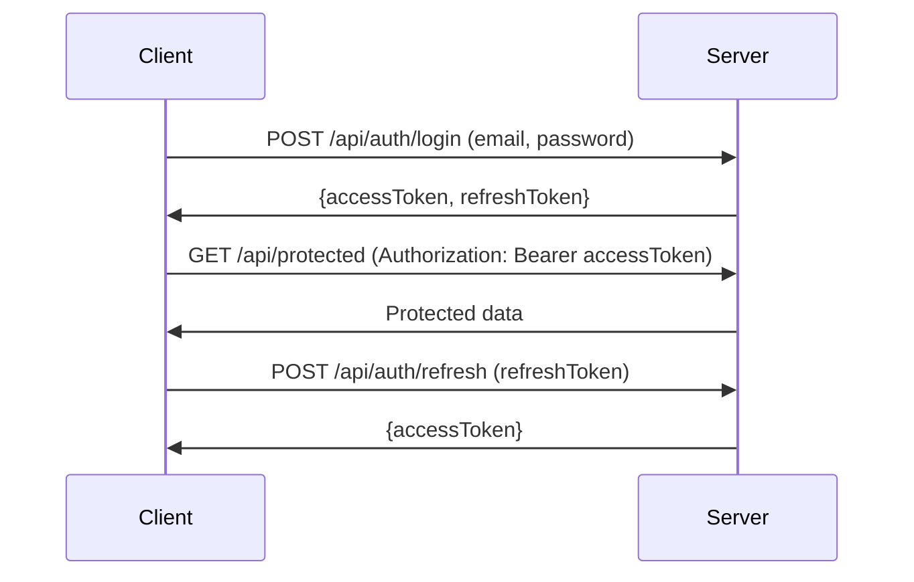

# INDULINK API Reference Guide

## Authentication System

### JWT Authentication Flow



### Authentication Endpoints

#### POST /api/auth/register
**Description**: Register a new user account
**Access**: Public
**Request**:
```json
{
  "firstName": "John",
  "lastName": "Doe",
  "email": "john.doe@example.com",
  "password": "securePassword123!",
  "phone": "+1234567890",
  "role": "customer"
}
```
**Response**:
```json
{
  "success": true,
  "message": "User registered successfully",
  "data": {
    "user": {
      "id": "5f8d0d55b54764421b7156a1",
      "firstName": "John",
      "lastName": "Doe",
      "email": "john.doe@example.com",
      "role": "customer",
      "createdAt": "2023-10-15T10:30:00.000Z"
    },
    "accessToken": "eyJhbGciOiJIUzI1NiIsInR5cCI6IkpXVCJ9...",
    "refreshToken": "eyJhbGciOiJIUzI1NiIsInR5cCI6IkpXVCJ9..."
  }
}
```

#### POST /api/auth/login
**Description**: Authenticate user and get tokens
**Access**: Public
**Request**:
```json
{
  "email": "john.doe@example.com",
  "password": "securePassword123!"
}
```
**Response**:
```json
{
  "success": true,
  "message": "Login successful",
  "data": {
    "user": {
      "id": "5f8d0d55b54764421b7156a1",
      "firstName": "John",
      "lastName": "Doe",
      "email": "john.doe@example.com",
      "role": "customer"
    },
    "accessToken": "eyJhbGciOiJIUzI1NiIsInR5cCI6IkpXVCJ9...",
    "refreshToken": "eyJhbGciOiJIUzI1NiIsInR5cCI6IkpXVCJ9..."
  }
}
```

#### POST /api/auth/refresh
**Description**: Refresh access token using refresh token
**Access**: Public
**Request**:
```json
{
  "refreshToken": "eyJhbGciOiJIUzI1NiIsInR5cCI6IkpXVCJ9..."
}
```
**Response**:
```json
{
  "success": true,
  "data": {
    "accessToken": "eyJhbGciOiJIUzI1NiIsInR5cCI6IkpXVCJ9..."
  }
}
```

#### POST /api/auth/logout
**Description**: Logout user and invalidate refresh token
**Access**: Private
**Response**:
```json
{
  "success": true,
  "message": "Logout successful"
}
```

#### GET /api/auth/me
**Description**: Get current authenticated user details
**Access**: Private
**Response**:
```json
{
  "success": true,
  "data": {
    "user": {
      "id": "5f8d0d55b54764421b7156a1",
      "firstName": "John",
      "lastName": "Doe",
      "email": "john.doe@example.com",
      "role": "customer",
      "phone": "+1234567890",
      "createdAt": "2023-10-15T10:30:00.000Z"
    }
  }
}
```

## User Management Endpoints

#### GET /api/users/profile
**Description**: Get user profile information
**Access**: Private
**Response**:
```json
{
  "success": true,
  "data": {
    "user": {
      "id": "5f8d0d55b54764421b7156a1",
      "firstName": "John",
      "lastName": "Doe",
      "email": "john.doe@example.com",
      "phone": "+1234567890",
      "role": "customer",
      "createdAt": "2023-10-15T10:30:00.000Z",
      "updatedAt": "2023-10-15T11:45:00.000Z"
    }
  }
}
```

#### PUT /api/users/profile
**Description**: Update user profile information
**Access**: Private
**Request**:
```json
{
  "firstName": "John",
  "lastName": "Smith",
  "phone": "+1987654321"
}
```
**Response**:
```json
{
  "success": true,
  "message": "Profile updated successfully",
  "data": {
    "user": {
      "id": "5f8d0d55b54764421b7156a1",
      "firstName": "John",
      "lastName": "Smith",
      "email": "john.doe@example.com",
      "phone": "+1987654321"
    }
  }
}
```

## Product Management Endpoints

#### GET /api/products
**Description**: Get all products with pagination and filtering
**Access**: Public
**Query Parameters**:
- `page`: Page number (default: 1)
- `limit`: Items per page (default: 10)
- `category`: Filter by category ID
- `search`: Search term for product name/description
- `minPrice`: Minimum price filter
- `maxPrice`: Maximum price filter
- `sort`: Sort field (name, price, createdAt)
- `order`: Sort order (asc, desc)

**Response**:
```json
{
  "success": true,
  "data": {
    "products": [
      {
        "id": "5f8d0d55b54764421b7156b2",
        "name": "Premium Headphones",
        "description": "High-quality wireless headphones",
        "price": 199.99,
        "category": "electronics",
        "stock": 50,
        "sku": "HP-001",
        "images": ["headphones.jpg"],
        "rating": 4.5,
        "reviewsCount": 12,
        "createdAt": "2023-10-10T09:00:00.000Z"
      }
    ],
    "pagination": {
      "total": 100,
      "page": 1,
      "limit": 10,
      "totalPages": 10
    }
  }
}
```

#### GET /api/products/:id
**Description**: Get single product details
**Access**: Public
**Response**:
```json
{
  "success": true,
  "data": {
    "product": {
      "id": "5f8d0d55b54764421b7156b2",
      "name": "Premium Headphones",
      "description": "High-quality wireless headphones with noise cancellation",
      "price": 199.99,
      "category": {
        "id": "cat123",
        "name": "Electronics"
      },
      "stock": 50,
      "sku": "HP-001",
      "images": ["headphones.jpg", "headphones-side.jpg"],
      "rating": 4.5,
      "reviews": [
        {
          "id": "rev123",
          "user": "John Doe",
          "rating": 5,
          "comment": "Excellent quality!",
          "date": "2023-10-12T14:30:00.000Z"
        }
      ],
      "createdAt": "2023-10-10T09:00:00.000Z"
    }
  }
}
```

#### POST /api/products/search
**Description**: Advanced product search
**Access**: Public
**Request**:
```json
{
  "query": "wireless",
  "categories": ["electronics"],
  "priceRange": [50, 300],
  "rating": 4,
  "sortBy": "price",
  "sortOrder": "asc"
}
```
**Response**:
```json
{
  "success": true,
  "data": {
    "results": [
      {
        "id": "5f8d0d55b54764421b7156b2",
        "name": "Premium Headphones",
        "price": 199.99,
        "rating": 4.5
      }
    ],
    "total": 5,
    "page": 1
  }
}
```

## Order Management Endpoints

#### POST /api/orders
**Description**: Create a new order
**Access**: Private (Customer)
**Request**:
```json
{
  "items": [
    {
      "productId": "5f8d0d55b54764421b7156b2",
      "quantity": 2,
      "price": 199.99
    }
  ],
  "shippingAddress": "123 Main St, City, Country",
  "paymentMethod": "credit_card",
  "totalAmount": 399.98,
  "shippingMethod": "standard"
}
```
**Response**:
```json
{
  "success": true,
  "message": "Order created successfully",
  "data": {
    "order": {
      "id": "ord12345",
      "userId": "5f8d0d55b54764421b7156a1",
      "items": [
        {
          "productId": "5f8d0d55b54764421b7156b2",
          "quantity": 2,
          "price": 199.99
        }
      ],
      "status": "pending",
      "totalAmount": 399.98,
      "shippingAddress": "123 Main St, City, Country",
      "paymentMethod": "credit_card",
      "createdAt": "2023-10-15T12:00:00.000Z"
    }
  }
}
```

#### GET /api/orders
**Description**: Get customer's orders
**Access**: Private (Customer)
**Response**:
```json
{
  "success": true,
  "data": {
    "orders": [
      {
        "id": "ord12345",
        "userId": "5f8d0d55b54764421b7156a1",
        "items": [
          {
            "productId": "5f8d0d55b54764421b7156b2",
            "quantity": 2,
            "price": 199.99
          }
        ],
        "status": "shipped",
        "totalAmount": 399.98,
        "createdAt": "2023-10-15T12:00:00.000Z",
        "updatedAt": "2023-10-16T09:30:00.000Z"
      }
    ]
  }
}
```

#### PUT /api/orders/:id/cancel
**Description**: Cancel an order
**Access**: Private (Customer)
**Response**:
```json
{
  "success": true,
  "message": "Order cancelled successfully"
}
```

## Category Management Endpoints

#### GET /api/categories
**Description**: Get all product categories
**Access**: Public
**Response**:
```json
{
  "success": true,
  "data": {
    "categories": [
      {
        "id": "cat123",
        "name": "Electronics",
        "description": "Electronic devices and accessories",
        "productCount": 45
      },
      {
        "id": "cat456",
        "name": "Clothing",
        "description": "Men and women clothing",
        "productCount": 87
      }
    ]
  }
}
```

#### GET /api/categories/:id
**Description**: Get single category details
**Access**: Public
**Response**:
```json
{
  "success": true,
  "data": {
    "category": {
      "id": "cat123",
      "name": "Electronics",
      "description": "Electronic devices and accessories",
      "products": [
        {
          "id": "5f8d0d55b54764421b7156b2",
          "name": "Premium Headphones",
          "price": 199.99
        }
      ]
    }
  }
}
```

## Review Management Endpoints

#### POST /api/reviews
**Description**: Add a product review
**Access**: Private (Customer)
**Request**:
```json
{
  "productId": "5f8d0d55b54764421b7156b2",
  "rating": 5,
  "comment": "Excellent product, works perfectly!",
  "title": "Great purchase"
}
```
**Response**:
```json
{
  "success": true,
  "message": "Review added successfully",
  "data": {
    "review": {
      "id": "rev123",
      "productId": "5f8d0d55b54764421b7156b2",
      "userId": "5f8d0d55b54764421b7156a1",
      "rating": 5,
      "comment": "Excellent product, works perfectly!",
      "title": "Great purchase",
      "createdAt": "2023-10-15T14:30:00.000Z"
    }
  }
}
```

#### GET /api/reviews/product/:productId
**Description**: Get reviews for a product
**Access**: Public
**Response**:
```json
{
  "success": true,
  "data": {
    "reviews": [
      {
        "id": "rev123",
        "user": "John Doe",
        "rating": 5,
        "comment": "Excellent product!",
        "title": "Great purchase",
        "date": "2023-10-15T14:30:00.000Z"
      }
    ],
    "averageRating": 4.7,
    "totalReviews": 8
  }
}
```

## Cart Management Endpoints

#### GET /api/cart
**Description**: Get user's shopping cart
**Access**: Private
**Response**:
```json
{
  "success": true,
  "data": {
    "cart": {
      "id": "cart123",
      "userId": "5f8d0d55b54764421b7156a1",
      "items": [
        {
          "productId": "5f8d0d55b54764421b7156b2",
          "quantity": 2,
          "price": 199.99,
          "name": "Premium Headphones"
        }
      ],
      "totalItems": 2,
      "totalPrice": 399.98
    }
  }
}
```

#### POST /api/cart/items
**Description**: Add item to cart
**Access**: Private
**Request**:
```json
{
  "productId": "5f8d0d55b54764421b7156b2",
  "quantity": 2
}
```
**Response**:
```json
{
  "success": true,
  "message": "Item added to cart",
  "data": {
    "cart": {
      "id": "cart123",
      "items": [
        {
          "productId": "5f8d0d55b54764421b7156b2",
          "quantity": 2
        }
      ]
    }
  }
}
```

## Supplier Management Endpoints

#### GET /api/supplier/products
**Description**: Get supplier's products
**Access**: Private (Supplier)
**Response**:
```json
{
  "success": true,
  "data": {
    "products": [
      {
        "id": "5f8d0d55b54764421b7156b2",
        "name": "Premium Headphones",
        "price": 199.99,
        "stock": 50,
        "sales": 125
      }
    ]
  }
}
```

#### POST /api/supplier/products
**Description**: Add new product (Supplier)
**Access**: Private (Supplier)
**Request**:
```json
{
  "name": "New Product",
  "description": "Product description",
  "price": 99.99,
  "category": "electronics",
  "stock": 100,
  "sku": "NEW-001"
}
```
**Response**:
```json
{
  "success": true,
  "message": "Product added successfully",
  "data": {
    "product": {
      "id": "5f8d0d55b54764421b7156c3",
      "name": "New Product",
      "price": 99.99
    }
  }
}
```

## Admin Management Endpoints

#### GET /api/admin/users
**Description**: Get all users (Admin)
**Access**: Private (Admin)
**Response**:
```json
{
  "success": true,
  "data": {
    "users": [
      {
        "id": "5f8d0d55b54764421b7156a1",
        "firstName": "John",
        "lastName": "Doe",
        "email": "john.doe@example.com",
        "role": "customer",
        "status": "active"
      }
    ],
    "total": 100
  }
}
```

#### PUT /api/admin/users/:id/status
**Description**: Update user status (Admin)
**Access**: Private (Admin)
**Request**:
```json
{
  "status": "active|inactive"
}
```
**Response**:
```json
{
  "success": true,
  "message": "User status updated"
}
```

## Error Handling Reference

### Standard Error Codes

| Code | Status | Description |
|------|--------|-------------|
| `UNAUTHORIZED` | 401 | Missing or invalid authentication |
| `FORBIDDEN` | 403 | Insufficient permissions |
| `NOT_FOUND` | 404 | Resource not found |
| `VALIDATION_ERROR` | 400 | Input validation failed |
| `DUPLICATE_ERROR` | 400 | Duplicate resource |
| `SERVER_ERROR` | 500 | Internal server error |
| `RATE_LIMIT_EXCEEDED` | 429 | Too many requests |
| `ACCOUNT_LOCKED` | 403 | Account temporarily locked |
| `WEAK_PASSWORD` | 400 | Password doesn't meet requirements |

### Error Response Examples

**Validation Error**:
```json
{
  "success": false,
  "message": "Validation error",
  "errors": [
    {
      "field": "email",
      "message": "Valid email is required"
    },
    {
      "field": "password",
      "message": "Password must be at least 6 characters"
    }
  ],
  "code": "VALIDATION_ERROR"
}
```

**Authentication Error**:
```json
{
  "success": false,
  "message": "Not authorized to access this route",
  "code": "UNAUTHORIZED"
}
```

**Rate Limit Error**:
```json
{
  "success": false,
  "message": "Too many requests from this IP, please try again later.",
  "code": "RATE_LIMIT_EXCEEDED"
}
```

## Integration Best Practices

### API Client Configuration

```javascript
// Recommended Axios configuration
const apiClient = axios.create({
  baseURL: 'http://localhost:5000/api',
  timeout: 10000,
  headers: {
    'Content-Type': 'application/json',
    'Accept': 'application/json'
  }
});

// Request interceptor for auth
apiClient.interceptors.request.use(config => {
  const token = localStorage.getItem('accessToken');
  if (token) {
    config.headers.Authorization = `Bearer ${token}`;
  }
  return config;
});

// Response interceptor for error handling
apiClient.interceptors.response.use(
  response => response.data,
  error => {
    if (error.response) {
      // Handle different error statuses
      switch (error.response.status) {
        case 401:
          // Handle unauthorized
          break;
        case 403:
          // Handle forbidden
          break;
        case 404:
          // Handle not found
          break;
        default:
          // Handle other errors
      }
    }
    return Promise.reject(error);
  }
);
```

### Security Best Practices

1. **Token Storage**: Store tokens securely (HttpOnly cookies or secure storage)
2. **Token Rotation**: Implement token refresh before expiration
3. **Input Validation**: Always validate API inputs on client side
4. **Error Handling**: Gracefully handle API errors in UI
5. **Rate Limiting**: Implement client-side rate limiting
6. **CORS**: Configure proper CORS settings
7. **HTTPS**: Always use HTTPS in production

## WebSocket Events Reference

### Available WebSocket Events

| Event | Description | Data Payload |
|-------|-------------|-------------|
| `product_updated` | Product information updated | `{ productId, updateType, data }` |
| `order_status_changed` | Order status changed | `{ orderId, newStatus, timestamp }` |
| `new_message` | New message received | `{ messageId, sender, content }` |
| `notification` | New notification | `{ notificationId, type, message }` |
| `cart_updated` | Shopping cart updated | `{ cartId, itemCount, totalPrice }` |

### WebSocket Connection Example

```javascript
import { io } from 'socket.io-client';

const socket = io('http://localhost:5000', {
  withCredentials: true,
  extraHeaders: {
    Authorization: `Bearer ${localStorage.getItem('accessToken')}`
  },
  reconnection: true,
  reconnectionAttempts: 5,
  reconnectionDelay: 1000
});

// Event listeners
socket.on('connect', () => {
  console.log('Connected to WebSocket server');
  socket.emit('subscribe', { userId: currentUser.id });
});

socket.on('product_updated', (data) => {
  // Update product in real-time
  updateProductInUI(data.productId);
});

socket.on('disconnect', () => {
  console.log('Disconnected from WebSocket server');
});

// Error handling
socket.on('connect_error', (error) => {
  console.error('WebSocket connection error:', error);
});
```

## Performance Optimization

### Caching Strategies

1. **Client-side caching**: Cache API responses with proper cache invalidation
2. **ETag support**: Use ETags for conditional requests
3. **Pagination**: Always use pagination for list endpoints
4. **Debouncing**: Debounce search and filter requests
5. **Lazy loading**: Implement lazy loading for images and data

### API Performance Tips

- Use `fields` parameter to request only needed fields
- Implement proper pagination with reasonable page sizes
- Cache frequently accessed data
- Use WebSocket for real-time updates instead of polling
- Optimize image uploads and downloads

## Monitoring and Analytics

### API Metrics Endpoint
**GET /api/metrics**
```json
{
  "success": true,
  "data": {
    "api": {
      "totalRequests": 1250,
      "responseTimes": {
        "avg": 125,
        "max": 450,
        "min": 35
      },
      "errorRate": 0.02,
      "endpoints": {
        "/api/products": {
          "requests": 850,
          "avgResponseTime": 110
        }
      }
    }
  }
}
```

### Health Check Endpoint
**GET /health**
```json
{
  "success": true,
  "message": "Indulink API is healthy",
  "environment": "production",
  "uptime": 86400,
  "memory": {
    "rss": 256,
    "heapTotal": 128,
    "heapUsed": 96
  },
  "infrastructure": {
    "database": "healthy",
    "cache": "healthy",
    "storage": "healthy"
  }
}
```

## API Versioning and Deprecation

### Versioning Strategy
- Current version: `v1`
- Base path: `/api/`
- Future versions will use `/api/v2/`, `/api/v3/`, etc.

### Deprecation Policy
- Deprecated endpoints will be marked in responses
- 6-month deprecation period before removal
- Deprecation warnings in response headers

## Support and Resources

### API Support
- **Email**: api-support@indulink.com
- **Documentation**: https://docs.indulink.com/api
- **Status Page**: https://status.indulink.com
- **Community Forum**: https://community.indulink.com

### SDKs and Libraries
- JavaScript/TypeScript SDK
- Mobile SDKs (iOS/Android)
- Postman collection
- OpenAPI/Swagger specification

This comprehensive API reference guide provides detailed specifications for all INDULINK e-commerce platform endpoints, including authentication, user management, product management, order processing, and all other system components with request/response examples and integration guides.