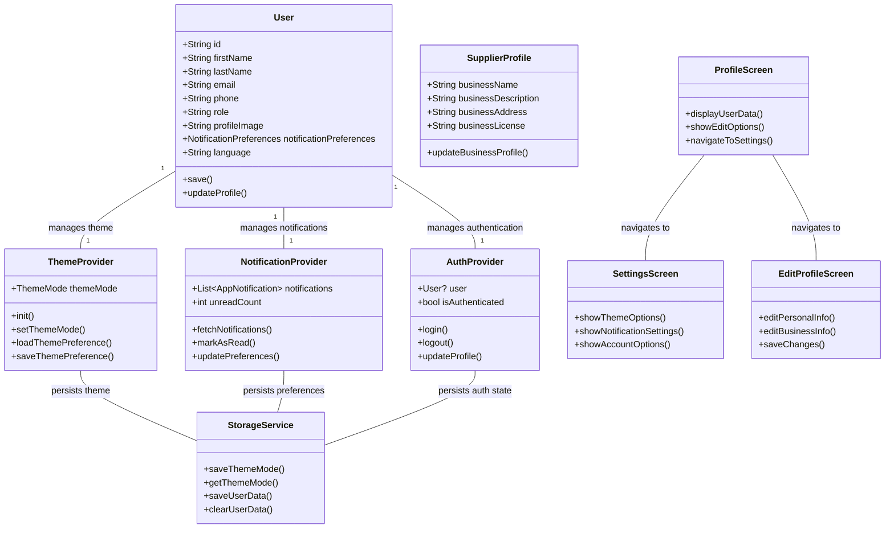
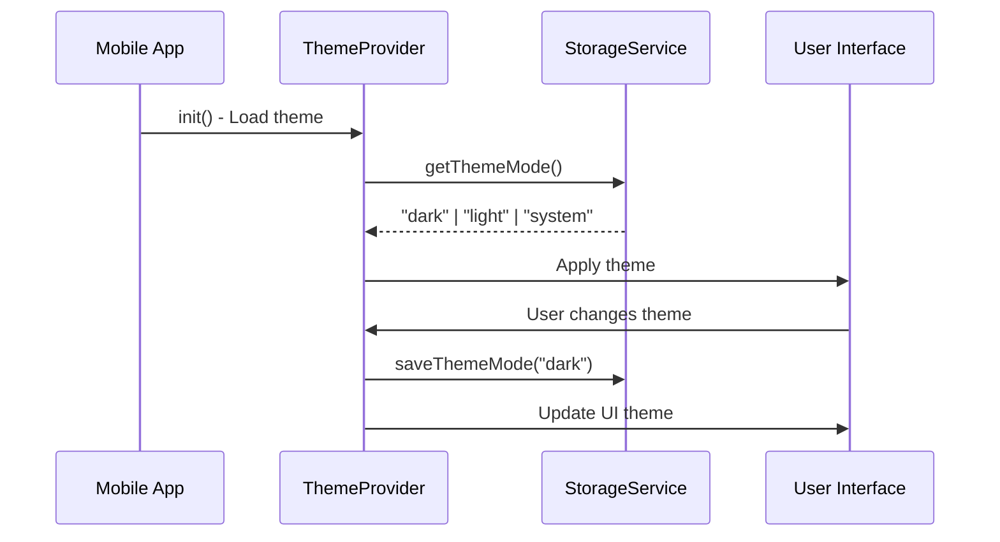
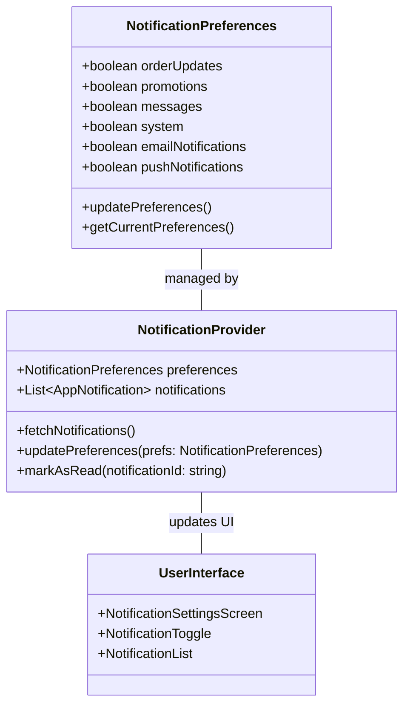
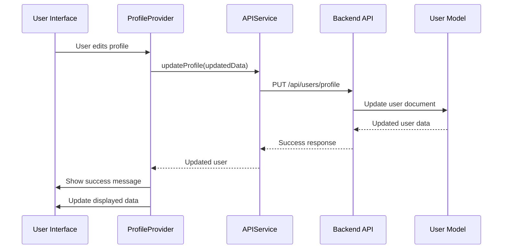
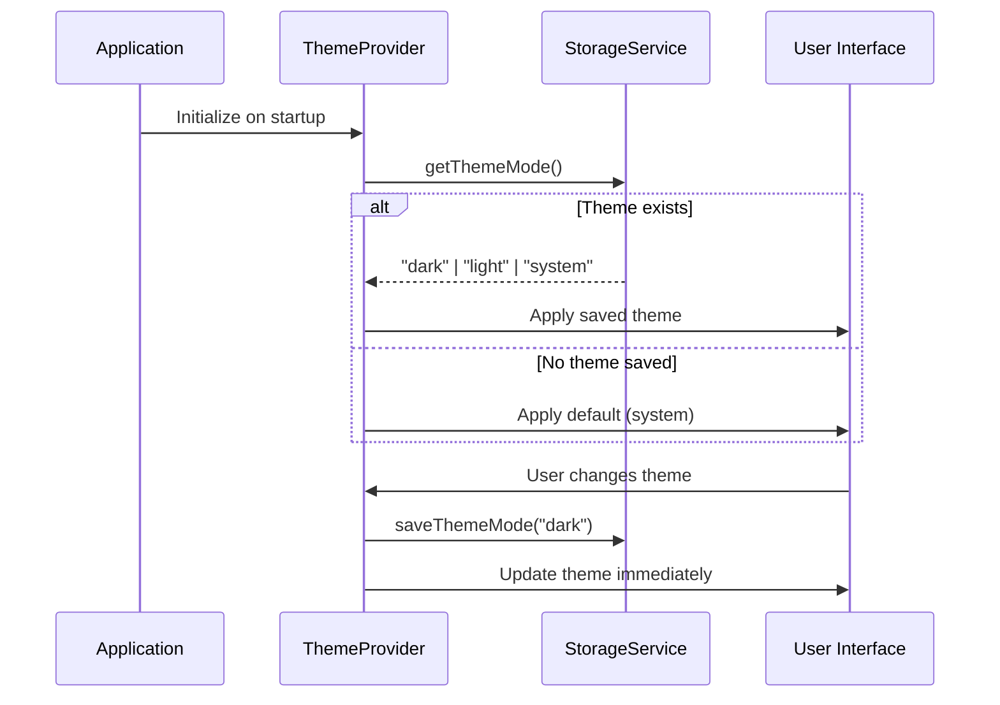
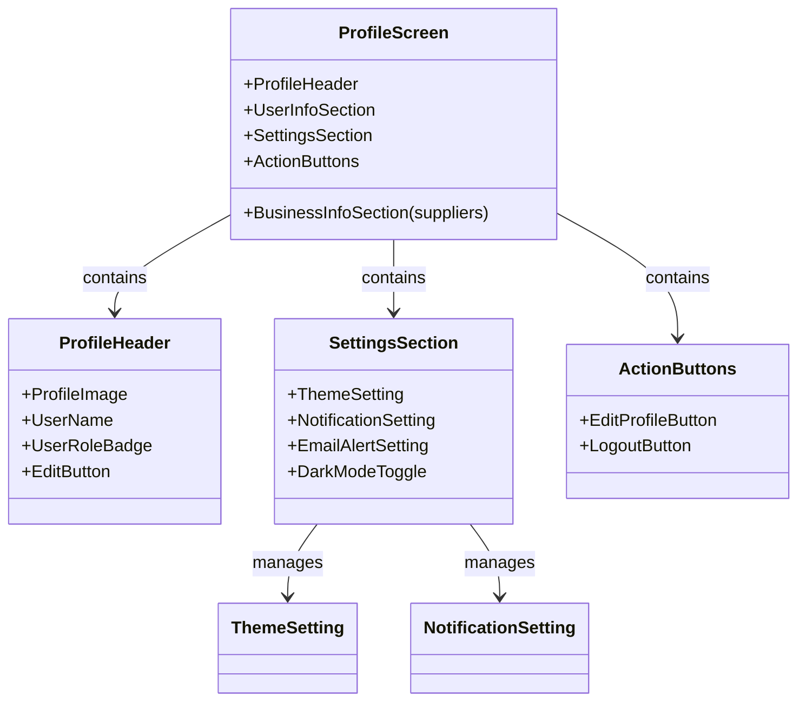
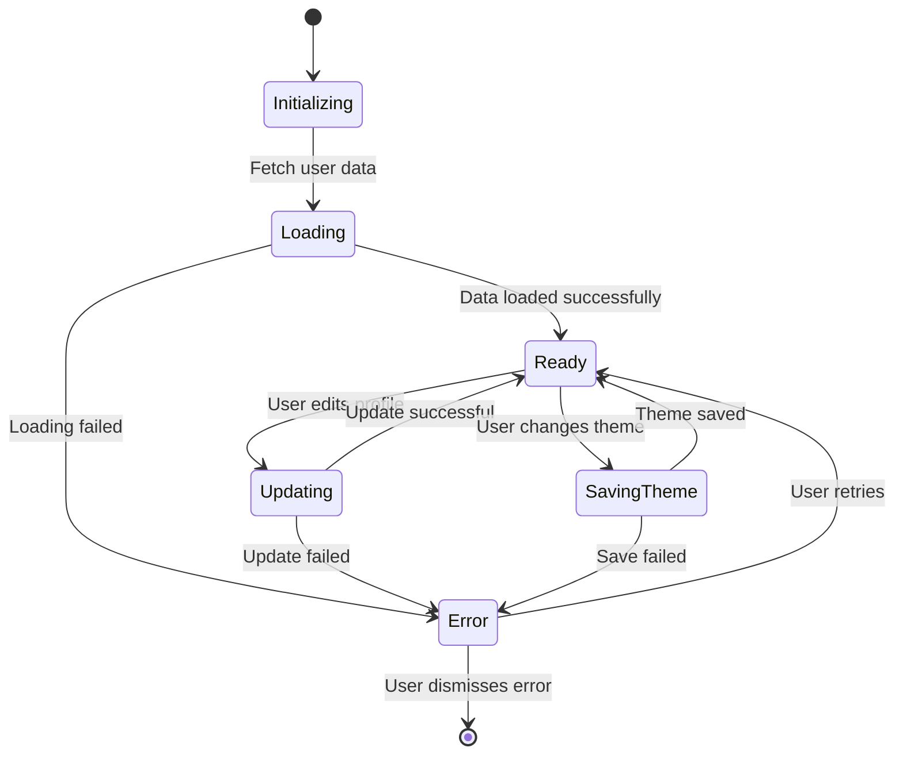

# 🏗️ INDULINK Profile Management Architecture

## 📋 Overview

This document provides a comprehensive architecture for the INDULINK profile management system, covering both customer and supplier profiles with all related functionality.

## 🎯 System Goals

1. **Unified Profile Management**: Single system handling both customer and supplier profiles
2. **Comprehensive Feature Set**: Complete profile functionality including personal/business data, preferences, and settings
3. **Theme Persistence**: User theme preferences that persist across sessions
4. **Notification Management**: Granular control over notification preferences
5. **Security & Privacy**: Secure authentication and data protection

## 🏗️ Architecture Diagram



## 🧩 Core Components

### 1. **User Model**
```typescript
interface User {
  // Core Fields
  id: string;
  firstName: string;
  lastName: string;
  email: string;
  phone: string;
  role: 'customer' | 'supplier' | 'admin';
  profileImage?: string;

  // Supplier-Specific Fields
  businessName?: string;
  businessDescription?: string;
  businessAddress?: string;
  businessLicense?: string;

  // Preferences
  notificationPreferences: NotificationPreferences;
  language: 'en' | 'ne' | 'hi';
  themeMode?: 'light' | 'dark' | 'system';

  // Methods
  save(): Promise<User>;
  updateProfile(data: Partial<User>): Promise<User>;
}

interface NotificationPreferences {
  orderUpdates: boolean;
  promotions: boolean;
  messages: boolean;
  system: boolean;
  emailNotifications: boolean;
  pushNotifications: boolean;
}
```

### 2. **Theme Management System**


### 3. **Notification Preferences System**


## 📁 File Structure

```
frontend/
├── lib/
│   ├── providers/
│   │   ├── auth_provider.dart          # Authentication & user management
│   │   ├── theme_provider.dart          # Theme management with persistence
│   │   ├── notification_provider.dart   # Notification management
│   │   └── profile_provider.dart        # Profile data management
│   │
│   ├── services/
│   │   ├── storage_service.dart         # Local storage for preferences
│   │   ├── api_service.dart             # API communication
│   │   └── notification_service.dart    # Notification services
│   │
│   ├── screens/
│   │   ├── customer/
│   │   │   └── profile/
│   │   │       ├── profile_screen.dart      # Customer profile view
│   │   │       ├── edit_profile_screen.dart # Edit personal info
│   │   │       └── settings_screen.dart     # Theme & notification settings
│   │   │
│   │   └── supplier/
│   │       └── profile/
│   │           ├── supplier_profile_screen.dart  # Supplier profile view
│   │           ├── edit_supplier_profile_screen.dart # Edit business info
│   │           └── supplier_settings_screen.dart   # Supplier-specific settings
│   │
│   └── models/
│       ├── user.dart                      # User data model
│       └── notification.dart             # Notification model
│
backend/
├── models/
│   └── User.js                          # MongoDB user schema
│
├── controllers/
│   ├── userController.js                # User profile APIs
│   └── notificationController.js        # Notification APIs
│
└── routes/
    └── userRoutes.js                     # Profile-related routes
```

## 🔄 Data Flow

### Profile Update Flow


### Theme Persistence Flow


## 🎨 UI Components Architecture

### Profile Screen Components


## 🔧 API Endpoints

### User Profile Endpoints
```
GET    /api/users/profile              # Get current user profile
PUT    /api/users/profile              # Update user profile
POST   /api/users/profile/image        # Upload profile image

GET    /api/users/notification-preferences  # Get notification preferences
PUT    /api/users/notification-preferences  # Update notification preferences
```

### Theme Management Endpoints
```
GET    /api/users/theme-preference      # Get saved theme preference
PUT    /api/users/theme-preference      # Save theme preference
```

## 📊 State Management

### Provider State Flow


## 🛡️ Security Considerations

1. **Authentication**: All profile endpoints require valid JWT tokens
2. **Authorization**: Users can only access their own profile data
3. **Data Validation**: Server-side validation for all profile updates
4. **Rate Limiting**: API endpoints have rate limiting
5. **Secure Storage**: Sensitive data encrypted in local storage

## 🚀 Performance Optimization

1. **Caching**: Profile data cached for 5 minutes
2. **Lazy Loading**: Business-specific fields loaded only for suppliers
3. **Optimized Updates**: Only changed fields sent in update requests
4. **Background Sync**: Theme preferences synced in background

## 📱 Mobile-Specific Considerations

1. **Offline Support**: Profile data cached for offline access
2. **Theme Persistence**: Theme preferences saved locally
3. **Notification Handling**: Push notification permissions managed
4. **Image Optimization**: Profile images compressed and cached

## 🔮 Future Enhancements

1. **Profile Completion Meter**: Visual indicator of profile completeness
2. **Multi-Language Support**: Expanded language preferences
3. **Profile Verification**: Business verification for suppliers
4. **Social Media Integration**: Connect social profiles
5. **Activity Analytics**: Profile activity and engagement metrics

## 📝 Implementation Checklist

- [x] User model with comprehensive profile fields
- [x] Supplier-specific business information
- [x] Theme provider with persistence
- [x] Notification preferences management
- [x] Profile edit screens for both user types
- [x] Settings screens with theme/notification controls
- [x] API endpoints for all profile operations
- [x] Storage service integration for persistence
- [x] Authentication and authorization
- [x] Error handling and validation
- [x] UI components and navigation
- [x] State management with providers

## 🎯 Key Benefits

1. **Unified Architecture**: Single system handles all profile types
2. **Comprehensive Features**: Complete profile management solution
3. **User Experience**: Consistent UI across all profile operations
4. **Data Persistence**: Theme and preferences persist across sessions
5. **Extensible Design**: Easy to add new profile features

This architecture provides a robust foundation for INDULINK's profile management system, supporting both current requirements and future growth.